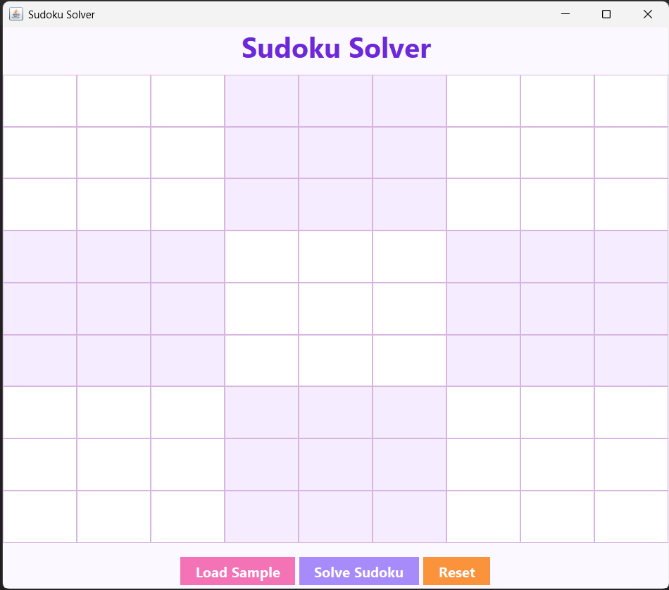
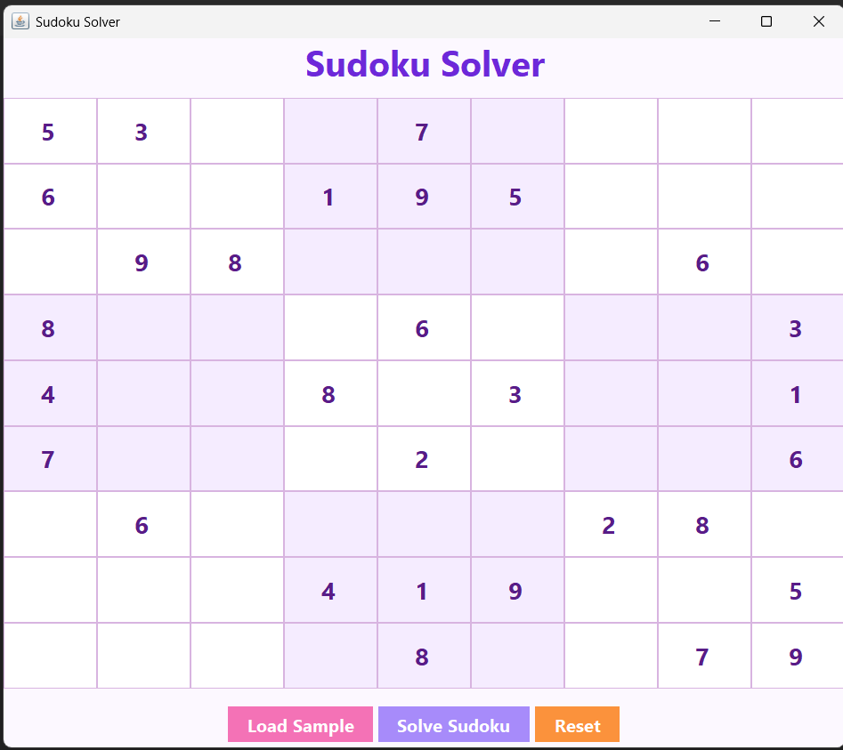
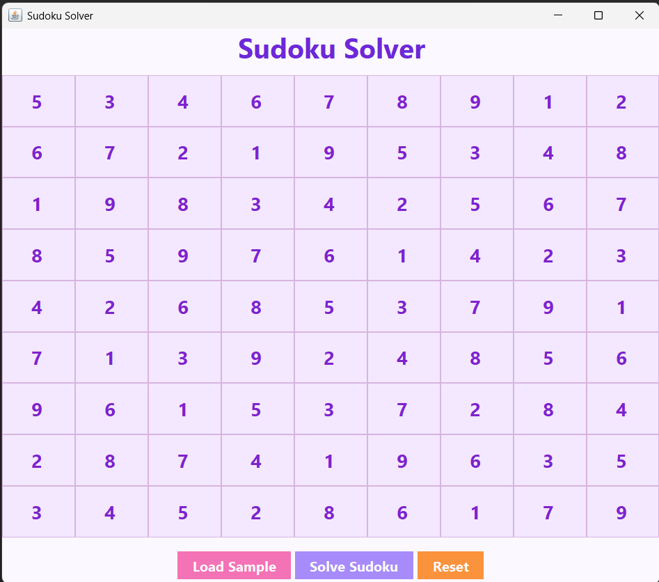

# Sudoku Solver GUI

## Task 03 - Sudoku Solver

A Java Swing-based Sudoku Solver that uses the Backtracking Algorithm and Recursion to solve Sudoku puzzles through an interactive graphical user interface.

## Features

- Interactive 9×9 Sudoku Grid
- Solve Sudoku using Backtracking
- Load Sample Puzzle
- Reset Board Functionality
- Input Validation
- User-Friendly GUI
- Automatic Puzzle Solving

## Technologies Used

- Java
- Java Swing
- Object-Oriented Programming (OOP)
- Recursion
- Backtracking Algorithm

## How to Run

### Compile

```bash
javac Sudoku.java
```

### Execute

```bash
java Sudoku
```

## How It Works

1. Enter a Sudoku puzzle or load a sample puzzle.
2. Click "Solve Sudoku".
3. The application uses the Backtracking Algorithm to find a valid solution.
4. The solved puzzle is displayed on the board.

## Screenshots

### Empty Board



### Sample Puzzle



### Solved Puzzle



## Concepts Learned

- GUI Development using Java Swing
- Event Handling
- Recursion
- Backtracking Algorithm
- 2D Arrays
- Problem Solving
- Input Validation

## Author

Manpreet Kaur

Software Development Intern @ SkillCraft Technology
